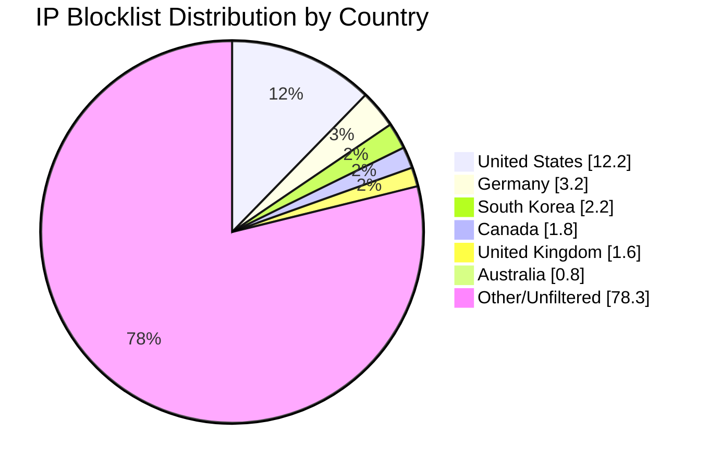

# Multi-Country IP Address Internet Blocklist Aggregator


          


* * *

Automated IP blocklist aggregation with multi-country geographical filtering

* * *

## 🚀 Features

- **Multi-Country Support**: Filter IPs from multiple countries - aggregate or individual lists
- **Automated Aggregation**: Combines multiple IP blocklists into a single deduplicated list
- **Geographical Filtering**: Filters IPs by country with support for multiple countries
- **Individual & Combined Files**: Generates both per-country files and combined multi-country files
- **Docker Support**: Runs in containerized environment for consistency
- **GitHub Actions**: Automated daily updates with manual trigger support
- **Multi-source**: Supports multiple URL sources via environment configuration
- **Enhanced Statistics**: Comprehensive reporting with per-country breakdowns

## 📊 Latest Statistics

**Last Updated:** 2025-08-22 14:37:48 UTC

## 📈 Country Distribution



## Overall Summary

- **Total Input IPs:** 605,910
- **Countries Processed:** 6
- **Combined Unique IPs:** 131,679
- **Combined Output File:** `aggregated-multi-6countries-combined.txt`
- **Overall Filter Rate:** 21.73%

## Per-Country Results

| Country | Code | Networks Found | Networks Optimized | IPs Matched | Filter Rate | Output File |
|---------|------|----------------|--------------------|-----------|-----------|-----------|
| United States | US | 217,567 | 216,153 | 74,094 | 12.23% | `aggregated-us-only.txt` |
| Canada | CA | 17,627 | 17,504 | 10,706 | 1.77% | `aggregated-ca-only.txt` |
| United Kingdom | GB | 32,830 | 32,667 | 9,897 | 1.63% | `aggregated-gb-only.txt` |
| Australia | AU | 11,306 | 11,248 | 4,682 | 0.77% | `aggregated-au-only.txt` |
| Germany | DE | 27,147 | 27,041 | 19,100 | 3.15% | `aggregated-de-only.txt` |
| South Korea | KR | 3,944 | 3,931 | 13,200 | 2.18% | `aggregated-kr-only.txt` |

## IP Sources

- **Source 1:** https://raw.githubusercontent.com/firehol/blocklist-ipsets/master/firehol_level1.netset
- **Source 2:** https://raw.githubusercontent.com/firehol/blocklist-ipsets/master/firehol_level2.netset
- **Source 3:** https://rules.emergingthreats.net/fwrules/emerging-Block-IPs.txt
- **Source 4:** https://raw.githubusercontent.com/borestad/blocklist-abuseipdb/main/abuseipdb-s100-30d.ipv4
- **Source 5:** https://feodotracker.abuse.ch/downloads/ipblocklist_recommended.txt
- **Source 6:** https://raw.githubusercontent.com/stamparm/ipsum/master/levels/3.txt
- **Source 7:** https://www.spamhaus.org/drop/drop.txt
- **Source 8:** https://www.spamhaus.org/drop/edrop.txt
- **Source 9:** https://raw.githubusercontent.com/romainmarcoux/malicious-ip/refs/heads/main/full-300k-aa.txt
- **Source 10:** https://raw.githubusercontent.com/romainmarcoux/malicious-ip/refs/heads/main/full-300k-ab.txt
- **Source 11:** https://raw.githubusercontent.com/romainmarcoux/malicious-ip/refs/heads/main/full-300k-ac.txt
- **Source 12:** https://raw.githubusercontent.com/romainmarcoux/malicious-ip/refs/heads/main/full-300k-ad.txt
- **Source 14:** http://cinsscore.com/list/ci-badguys.txt
- **Source 15:** https://cdn.jsdelivr.net/gh/LittleJake/ip-blacklist/all_blacklist.txt

## Configuration Details


### 📁 Generated Files

- **`aggregated.txt`** - 605,910 total aggregated IPs from all sources
- **`aggregated-au-only.txt`** - 4,682 IPs from AU
- **`aggregated-ca-only.txt`** - 10,706 IPs from CA
- **`aggregated-de-only.txt`** - 19,100 IPs from DE
- **`aggregated-gb-only.txt`** - 9,897 IPs from GB
- **`aggregated-kr-only.txt`** - 13,200 IPs from KR
- **`aggregated-us-only.txt`** - 74,094 IPs from US
- **`aggregated-multi-6countries-combined.txt`** - 131,679 unique IPs (deduplicated across all countries)

---

## 🛴 Install

Set up your own copy of this repository to aggregate and filter your IP blocklists for multiple countries.

* * *

### 👆 Click the green "Use this template" button in the upper right corner

         
1. **Sign in** to GitHub and navigate to [this repository](https://github.com/MarcusHoltz/ipblocklist-geofiltered-aggregator).
2. Click the **"Use this template"** button (in the upper right corner).
3. Select **Create a new repository**. Enter a name (e.g., `my-eu-badip-blocklist`), and confirm.
4. Your new repository is now independent — it will not share commit history with the original.
5. You can immediately begin editing or configuring it for your own multi-country IP aggregation project.

> The **"Use this template"** button on GitHub allows you to quickly create a new, independent repository pre-populated with the project's files and structure. Your new repository won't inherit commit history from the template. This is perfect for your personal blocklist repo.

*Usage is below for steps on running this repository with Github Actions in your new IP aggregation project.*


## 🛠 Usage

### GitHub Actions (Recommended)

#### First Step - Enable Write Permissions

1. **Enable Actions**: Go to Settings > Actions > General > Workflow permissions
2. **Set Permissions**: Select "Read and write permissions", click "Save".


#### Second Step - Configure The Repo

3. **Configure Environment**: Edit `.env` file with your desired sources and countries
4. **Your Favorite Blocklists**: Load as many blocklists as you like, just make sure the line starts with `LIST1_`, `LIST2_`, `LIST3_`, etc.
5. **Multiple Countries**: Countries can be modified the same way, `COUNTRY_ISO_CODE_1`, `COUNTRY_NAME_1`, `COUNTRY_ISO_CODE_2`, `COUNTRY_NAME_2`, etc.
6. **Find Country Codes**: You can find your country codes in the [geoip2-ipv4 spreadsheet](https://datahub.io/core/geoip2-ipv4)
7. **Automatic Runs**: The workflow runs twice daily. At both **02:17 AM/PM UTC** or it will run anytime if you [modified the cron file](https://github.com/MarcusHoltz/ipblocklist-geofiltered-aggregator/edit/main/.github/workflows/ip-aggregation.yml)


#### Third Step - Running This Action

8. **Run This Now**: You can run this Github Action by using the "Action" tab up top
9. **Generate Multi-Country Blocklists**: Under "All workflows" you can find this action
10. **Run workflow**: On this page, off to the right is a button with a dropdown to "Run workflow"
11. **Off to the races**: Each run will consume some of your free monthly Github Actions 2000 min (33.3 hours)

> Please adjust cron, it is how often your aggregator runs in [.github/workflows/ip-aggregation.yml](https://github.com/MarcusHoltz/ipblocklist-geofiltered-aggregator/edit/main/.github/workflows/ip-aggregation.yml), also modify your blacklists and countries in the [.env](https://github.com/MarcusHoltz/ipblocklist-geofiltered-aggregator/edit/main/.env) file.

## ⚙ Configuration

### 🌍 Multi-Country Setup

The `.env` file supports multiple countries:

```bash
# European Union Example
COUNTRY_ISO_CODE_1=DE
COUNTRY_NAME_1=Germany

COUNTRY_ISO_CODE_2=FR
COUNTRY_NAME_2=France

COUNTRY_ISO_CODE_3=NL
COUNTRY_NAME_3=Netherlands

COUNTRY_ISO_CODE_4=IT
COUNTRY_NAME_4=Italy

COUNTRY_ISO_CODE_5=ES
COUNTRY_NAME_5=Spain
```

This will generate:
- `aggregated-de-only.txt` (Germany IPs)
- `aggregated-fr-only.txt` (France IPs) 
- `aggregated-nl-only.txt` (Netherlands IPs)
- `aggregated-it-only.txt` (Italy IPs)
- `aggregated-es-only.txt` (Spain IPs)
- `aggregated-multi-5countries-combined.txt` (All countries combined, deduplicated)

### Sample .env file

```bash
# Add your IP list sources
LIST_1=https://example.com/blocklist1.txt
LIST_2=https://example.com/blocklist2.txt

# Set multiple countries (NEW FEATURE!)
COUNTRY_ISO_CODE_1=DE
COUNTRY_NAME_1=Germany

COUNTRY_ISO_CODE_2=FR  
COUNTRY_NAME_2=France

# Configure paths (usually don't need to change)
GEOIP_CSV_PATH=/data/geoip/geoip2-ipv4.csv
ALL_IPS_FROM_LISTS=/data/output/aggregated.txt
```

## 🏠 Local Deployment (Alternative)

If you'd rather download this repo and run this project offline, the instructions are below:

### 1. Clone the repository

The first step is to download the files from the internet, and get them locally on your machine.

```bash
git clone https://github.com/MarcusHoltz/ipblocklist-geofiltered-aggregator.git
```

### 2. Configure your sources and countries in .env

The next step is to configure the project to your liking. Edit your `.env` file. You can enter as many IP based block lists as you need and configure multiple countries.

```bash
nano .env
```

### 3. Run with Docker Compose

You can now run the project and see what happens.

```bash
docker compose up --build
```

### 4. Check results

Let's see what happened!

```bash
ls -la data/output/
```

## 📁 Output Files

### Per-Country Files
- `data/output/aggregated-{country-code}-only.txt` - Country-specific IPs (e.g., `aggregated-de-only.txt` for Germany)

### Combined Multi-Country Files  
- `data/output/aggregated-multi-{number-of-countries-total}countries-combined.txt` - Combined IPs from all countries (deduplicated)
- Example: `aggregated-multi-3countries-combined.txt` for Germany + France + Netherlands

### Core Files
- `data/output/aggregated.txt` - All deduplicated IPs from all sources (before country filtering)
- `data/output/stats.md` - Comprehensive processing statistics with per-country breakdowns

## 🔄 Workflow Triggers

The GitHub Action runs automatically when:

- **Daily Schedule**: Every day, twice. Once at at 02:17 AM UTC and then again at 02:17 PM UTC
- **File Changes**: When `.env`, `Dockerfile`, or key scripts are modified
- **Manual Trigger**: Via GitHub Actions interface


## 🧹 Starting With Clean Output

If you're going to customize the list: 

- You should remove the [./data/output](https://github.com/MarcusHoltz/ipblocklist-geofiltered-aggregator/edit/main/data/output) folder, as it will only contain data pertinent to the last run.

- Always remove the [./data/output](https://github.com/MarcusHoltz/ipblocklist-geofiltered-aggregator/edit/main/data/output) folder when you customize the countries. 

> This will ensure you dont include older, unused countries in your new aggreagtion lists.


## ⚡ Performance

- **Multi-Country Processing**: Parallel processing of multiple countries
- **Processing Speed**: ~10,000 IPs per second for filtering per country
- **Parallel Processing**: Multi-core optimization for large datasets  
- **Memory Efficient**: Streaming processing for large files
- **Optimized Lookup**: Integer-based IP range matching with SubnetTree
- **Network Optimization**: Automatic collapsing of overlapping CIDR blocks

## 🌼 Features and Optimizations

- **🌍 Multi-country IP blocklist aggregation** for comprehensive regional security  
- **📊 Per-country statistical analysis** with detailed filtering metrics
- **🔄 Automated multi-country updates** via GitHub Actions
- **🚀 Parallel country processing** for improved performance
- **📁 Individual and combined output files** for flexible deployment
- **🛡️ Regional threat mitigation** with configurable multi-country rules
- **💾 Memory-efficient processing** even with multiple large country datasets
- **🔗 Network optimization** with automatic CIDR block collapsing

## 👍 Acknowledgements

This project would not have been possible without the amazing work of the following other projects:

* * *

### 🎩 Datopian

Thank you to [Datopian](https://github.com/datasets/geoip2-ipv4) for maintaining the [GeoIP2 IPv4 dataset](https://datahub.io/core/geoip2-ipv4). This dataset provides otherwise impossible information for IP geolocation, allowing this project to filter IPs based on multiple countries simultaneously.

- [GeoIP2 IPv4 Dataset](https://datahub.io/core/geoip2-ipv4) by Datopian is essential for filtering and identifying IP addresses across various countries, enabling the dynamic multi-country functionality of this project.


* * *

### 🦘 Andrew Twin

Special thanks to [Andrew Twin](https://github.com/andrewtwin) for creating and sharing the [IP Aggregator](https://github.com/andrewtwin/ip-aggregator) project. Andrew's work on efficiently aggregating IP blocklists was a fundamental inspiration and foundation for this enhanced multi-country version.

- The [IP Aggregator](https://github.com/andrewtwin/ip-aggregator) allows easy downloading, parsing, and filtering of multiple IP blocklists, which this project leverages and extends for multi-country IP management tasks.


* * *

### 📗 Blocklist maintainers

I would like to additionally acknowledge the maintainers and contributors of various [IP blocklists](https://github.com/topics/ip-blocklist) and [IP blacklists](https://github.com/topics/ip-blacklist). Thank you for maintaining up-to-date, community-driven threat intelligence that forms the foundation of generating these multi-country filtered files. While the specific lists in this repo may vary, the collective dedication to improving online security and privacy of all contributors is deeply appreciated.


* * *

