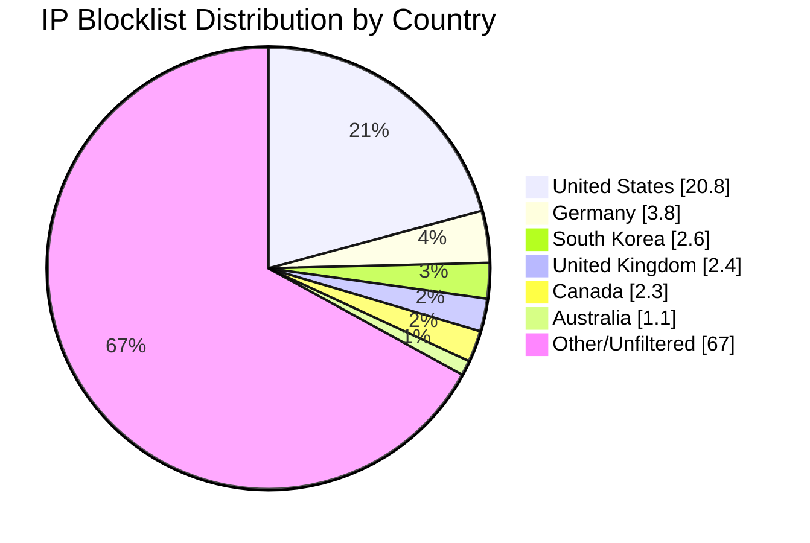

# Multi-Country IP Aggregation Statistics

**Last Updated:** 2026-01-02 14:41:36 UTC

## 📈 Country Distribution

```mermaid
pie showData title IP Blocklist Distribution by Country
"United States" : 20.8
"Germany" : 3.8
"South Korea" : 2.6
"United Kingdom" : 2.4
"Canada" : 2.3
"Australia" : 1.1
"Other/Unfiltered" : 67.0
```

## Overall Summary

- **Total Input IPs:** 556,664
- **Countries Processed:** 6
- **Combined Unique IPs:** 183,877
- **Combined Output File:** `aggregated-multi-6countries-combined.txt`
- **Overall Filter Rate:** 33.03%

## Per-Country Results

| Country | Code | Networks Found | Networks Optimized | IPs Matched | Filter Rate | Output File |
|---------|------|----------------|--------------------|-----------|-----------|-----------|
| United States | US | 199,419 | 197,811 | 116,026 | 20.84% | `aggregated-us-only.txt` |
| Canada | CA | 17,248 | 17,118 | 12,949 | 2.33% | `aggregated-ca-only.txt` |
| United Kingdom | GB | 33,774 | 33,608 | 13,102 | 2.35% | `aggregated-gb-only.txt` |
| Australia | AU | 11,596 | 11,526 | 6,002 | 1.08% | `aggregated-au-only.txt` |
| Germany | DE | 27,528 | 27,389 | 21,325 | 3.83% | `aggregated-de-only.txt` |
| South Korea | KR | 3,990 | 3,989 | 14,473 | 2.60% | `aggregated-kr-only.txt` |

## IP Sources

- **Source 1:** https://raw.githubusercontent.com/firehol/blocklist-ipsets/master/firehol_level1.netset
- **Source 2:** https://raw.githubusercontent.com/firehol/blocklist-ipsets/master/firehol_level2.netset
- **Source 3:** https://rules.emergingthreats.net/fwrules/emerging-Block-IPs.txt
- **Source 4:** https://raw.githubusercontent.com/borestad/blocklist-abuseipdb/main/abuseipdb-s100-30d.ipv4
- **Source 5:** https://feodotracker.abuse.ch/downloads/ipblocklist_recommended.txt
- **Source 6:** https://raw.githubusercontent.com/stamparm/ipsum/master/levels/3.txt
- **Source 7:** https://www.spamhaus.org/drop/drop.txt
- **Source 8:** https://www.spamhaus.org/drop/edrop.txt
- **Source 9:** https://raw.githubusercontent.com/romainmarcoux/malicious-ip/refs/heads/main/full-300k-aa.txt
- **Source 10:** https://raw.githubusercontent.com/romainmarcoux/malicious-ip/refs/heads/main/full-300k-ab.txt
- **Source 11:** https://raw.githubusercontent.com/romainmarcoux/malicious-ip/refs/heads/main/full-300k-ac.txt
- **Source 12:** https://raw.githubusercontent.com/romainmarcoux/malicious-ip/refs/heads/main/full-300k-ad.txt
- **Source 14:** http://cinsscore.com/list/ci-badguys.txt
- **Source 15:** https://cdn.jsdelivr.net/gh/LittleJake/ip-blacklist/all_blacklist.txt

## Configuration Details

