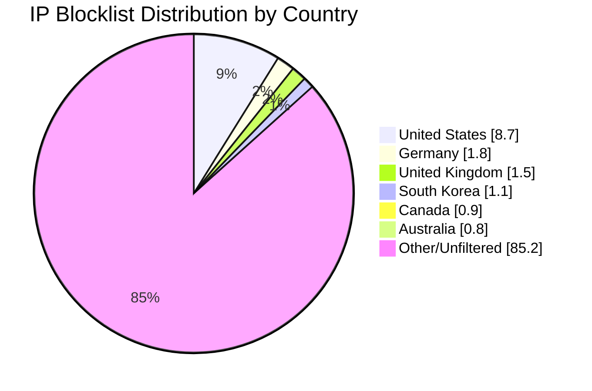

# Multi-Country IP Aggregation Statistics

**Last Updated:** 2025-08-27 15:31:26 UTC

## 📈 Country Distribution

```mermaid
pie showData title IP Blocklist Distribution by Country
"United States" : 8.7
"Germany" : 1.8
"United Kingdom" : 1.5
"South Korea" : 1.1
"Canada" : 0.9
"Australia" : 0.8
"Other/Unfiltered" : 85.2
```

## Overall Summary

- **Total Input IPs:** 363,228
- **Countries Processed:** 6
- **Combined Unique IPs:** 53,686
- **Combined Output File:** `aggregated-multi-6countries-combined.txt`
- **Overall Filter Rate:** 14.78%

## Per-Country Results

| Country | Code | Networks Found | Networks Optimized | IPs Matched | Filter Rate | Output File |
|---------|------|----------------|--------------------|-----------|-----------|-----------|
| United States | US | 218,244 | 216,816 | 31,658 | 8.72% | `aggregated-us-only.txt` |
| Canada | CA | 17,804 | 17,678 | 3,150 | 0.87% | `aggregated-ca-only.txt` |
| United Kingdom | GB | 32,316 | 32,142 | 5,337 | 1.47% | `aggregated-gb-only.txt` |
| Australia | AU | 11,315 | 11,257 | 3,001 | 0.83% | `aggregated-au-only.txt` |
| Germany | DE | 27,285 | 27,176 | 6,416 | 1.77% | `aggregated-de-only.txt` |
| South Korea | KR | 3,946 | 3,933 | 4,124 | 1.14% | `aggregated-kr-only.txt` |

## IP Sources

- **Source 1:** https://raw.githubusercontent.com/firehol/blocklist-ipsets/master/firehol_level1.netset
- **Source 2:** https://raw.githubusercontent.com/firehol/blocklist-ipsets/master/firehol_level2.netset
- **Source 3:** https://rules.emergingthreats.net/fwrules/emerging-Block-IPs.txt
- **Source 4:** https://raw.githubusercontent.com/borestad/blocklist-abuseipdb/main/abuseipdb-s100-30d.ipv4
- **Source 5:** https://feodotracker.abuse.ch/downloads/ipblocklist_recommended.txt
- **Source 6:** https://raw.githubusercontent.com/stamparm/ipsum/master/levels/3.txt
- **Source 7:** https://www.spamhaus.org/drop/drop.txt
- **Source 8:** https://www.spamhaus.org/drop/edrop.txt
- **Source 9:** https://raw.githubusercontent.com/romainmarcoux/malicious-ip/refs/heads/main/full-300k-aa.txt
- **Source 10:** https://raw.githubusercontent.com/romainmarcoux/malicious-ip/refs/heads/main/full-300k-ab.txt
- **Source 11:** https://raw.githubusercontent.com/romainmarcoux/malicious-ip/refs/heads/main/full-300k-ac.txt
- **Source 12:** https://raw.githubusercontent.com/romainmarcoux/malicious-ip/refs/heads/main/full-300k-ad.txt
- **Source 14:** http://cinsscore.com/list/ci-badguys.txt
- **Source 15:** https://cdn.jsdelivr.net/gh/LittleJake/ip-blacklist/all_blacklist.txt
- **Source VPS4:** https://raw.githubusercontent.com/jhassine/server-ip-addresses/master/data/datacenters.txt
- **Source VPS2:** https://github.com/hexydec/ip-ranges/raw/refs/heads/main/output/crawlers-ipv4.txt
- **Source VPS1:** https://raw.githubusercontent.com/the-furry-hubofeverything/vps-ranges/refs/heads/main/ip.txt

## Configuration Details

