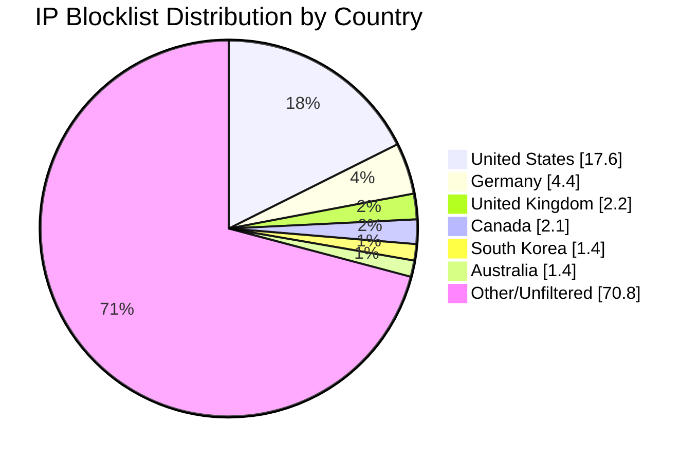

# Multi-Country IP Aggregation Statistics

**Last Updated:** 2026-07-25 05:26:36 UTC

## 📈 Country Distribution

```mermaid
pie showData title IP Blocklist Distribution by Country
"United States" : 17.6
"Germany" : 4.4
"United Kingdom" : 2.2
"Canada" : 2.1
"South Korea" : 1.4
"Australia" : 1.4
"Other/Unfiltered" : 70.8
```

## Overall Summary

- **Total Input IPs:** 443,831
- **Countries Processed:** 6
- **Combined Unique IPs:** 129,626
- **Combined Output File:** `aggregated-multi-6countries-combined.txt`
- **Overall Filter Rate:** 29.21%

## Per-Country Results

| Country | Code | Networks Found | Networks Optimized | IPs Matched | Filter Rate | Output File |
|---------|------|----------------|--------------------|-----------|-----------|-----------|
| United States | US | 137,787 | 135,973 | 78,249 | 17.63% | `aggregated-us-only.txt` |
| Canada | CA | 16,857 | 16,741 | 9,359 | 2.11% | `aggregated-ca-only.txt` |
| United Kingdom | GB | 35,446 | 35,279 | 9,888 | 2.23% | `aggregated-gb-only.txt` |
| Australia | AU | 12,109 | 12,038 | 6,246 | 1.41% | `aggregated-au-only.txt` |
| Germany | DE | 29,153 | 29,083 | 19,521 | 4.40% | `aggregated-de-only.txt` |
| South Korea | KR | 3,909 | 3,899 | 6,363 | 1.43% | `aggregated-kr-only.txt` |

## IP Sources

- **Source 1:** https://raw.githubusercontent.com/firehol/blocklist-ipsets/master/firehol_level1.netset
- **Source 2:** https://raw.githubusercontent.com/firehol/blocklist-ipsets/master/firehol_level2.netset
- **Source 3:** https://rules.emergingthreats.net/fwrules/emerging-Block-IPs.txt
- **Source 4:** https://raw.githubusercontent.com/borestad/blocklist-abuseipdb/main/abuseipdb-s100-30d.ipv4
- **Source 5:** https://feodotracker.abuse.ch/downloads/ipblocklist_recommended.txt
- **Source 6:** https://raw.githubusercontent.com/stamparm/ipsum/master/levels/3.txt
- **Source 7:** https://www.spamhaus.org/drop/drop.txt
- **Source 8:** https://www.spamhaus.org/drop/edrop.txt
- **Source 9:** https://raw.githubusercontent.com/romainmarcoux/malicious-ip/refs/heads/main/full-300k-aa.txt
- **Source 10:** https://raw.githubusercontent.com/romainmarcoux/malicious-ip/refs/heads/main/full-300k-ab.txt
- **Source 11:** https://raw.githubusercontent.com/romainmarcoux/malicious-ip/refs/heads/main/full-300k-ac.txt
- **Source 12:** https://raw.githubusercontent.com/romainmarcoux/malicious-ip/refs/heads/main/full-300k-ad.txt
- **Source 14:** http://cinsscore.com/list/ci-badguys.txt
- **Source 15:** https://cdn.jsdelivr.net/gh/LittleJake/ip-blacklist/all_blacklist.txt

## Configuration Details

