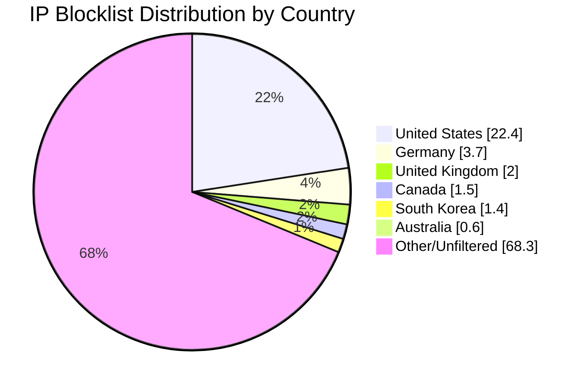

# Multi-Country IP Aggregation Statistics

**Last Updated:** 2026-10-27 08:00:14 UTC

## 📈 Country Distribution

```mermaid
pie showData title IP Blocklist Distribution by Country
"United States" : 22.4
"Germany" : 3.7
"United Kingdom" : 2.0
"Canada" : 1.5
"South Korea" : 1.4
"Australia" : 0.6
"Other/Unfiltered" : 68.3
```

## Overall Summary

- **Total Input IPs:** 820,292
- **Countries Processed:** 6
- **Combined Unique IPs:** 259,980
- **Combined Output File:** `aggregated-multi-6countries-combined.txt`
- **Overall Filter Rate:** 31.69%

## Per-Country Results

| Country | Code | Networks Found | Networks Optimized | IPs Matched | Filter Rate | Output File |
|---------|------|----------------|--------------------|-----------|-----------|-----------|
| United States | US | 129,057 | 127,188 | 184,002 | 22.43% | `aggregated-us-only.txt` |
| Canada | CA | 17,613 | 17,490 | 12,486 | 1.52% | `aggregated-ca-only.txt` |
| United Kingdom | GB | 36,267 | 36,097 | 16,299 | 1.99% | `aggregated-gb-only.txt` |
| Australia | AU | 12,281 | 12,208 | 5,248 | 0.64% | `aggregated-au-only.txt` |
| Germany | DE | 30,284 | 30,174 | 30,715 | 3.74% | `aggregated-de-only.txt` |
| South Korea | KR | 4,030 | 4,002 | 11,230 | 1.37% | `aggregated-kr-only.txt` |

## IP Sources

- **Source 1:** https://raw.githubusercontent.com/firehol/blocklist-ipsets/master/firehol_level1.netset
- **Source 2:** https://raw.githubusercontent.com/firehol/blocklist-ipsets/master/firehol_level2.netset
- **Source 3:** https://rules.emergingthreats.net/fwrules/emerging-Block-IPs.txt
- **Source 4:** https://raw.githubusercontent.com/borestad/blocklist-abuseipdb/main/abuseipdb-s100-30d.ipv4
- **Source 5:** https://feodotracker.abuse.ch/downloads/ipblocklist_recommended.txt
- **Source 6:** https://raw.githubusercontent.com/stamparm/ipsum/master/levels/3.txt
- **Source 7:** https://www.spamhaus.org/drop/drop.txt
- **Source 8:** https://www.spamhaus.org/drop/edrop.txt
- **Source 9:** https://raw.githubusercontent.com/romainmarcoux/malicious-ip/refs/heads/main/full-300k-aa.txt
- **Source 10:** https://raw.githubusercontent.com/romainmarcoux/malicious-ip/refs/heads/main/full-300k-ab.txt
- **Source 11:** https://raw.githubusercontent.com/romainmarcoux/malicious-ip/refs/heads/main/full-300k-ac.txt
- **Source 12:** https://raw.githubusercontent.com/romainmarcoux/malicious-ip/refs/heads/main/full-300k-ad.txt
- **Source 14:** http://cinsscore.com/list/ci-badguys.txt
- **Source 15:** https://cdn.jsdelivr.net/gh/LittleJake/ip-blacklist/all_blacklist.txt

## Configuration Details

